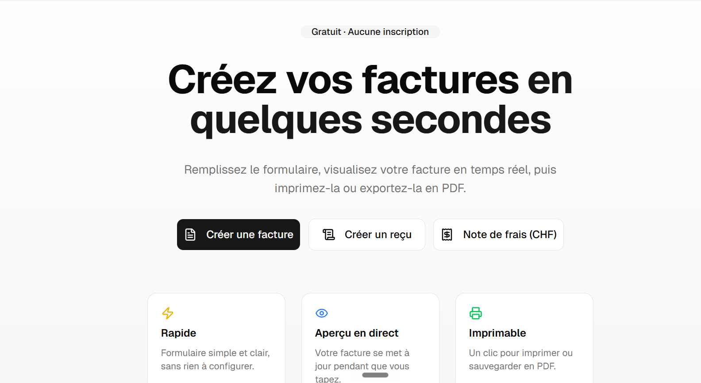

# Invoice Generator



Application web pour créer, éditer et imprimer des factures professionnelles, des reçus et des notes de frais — sans inscription, sans serveur, 100% dans le navigateur.

Conçue pour les freelances et les petites entreprises françaises et suisses.

---

## Fonctionnalités

### Documents
- **Factures** — numérotation automatique, TVA configurable, conformité légale française (Art. L441-10 / D441-5)
- **Reçus** — génération rapide depuis les informations expéditeur existantes
- **Notes de frais** — réglementation suisse incluse

### Chatbot vocal (IA)
- Dictez votre facture à voix haute : l'IA (Google Gemini) remplit les champs automatiquement
- Aucune donnée ne transite par un serveur — la clé API est stockée uniquement dans votre navigateur

### Gestion des documents
- Sauvegarde locale dans le navigateur (localStorage)
- Chargement, duplication et renommage des documents sauvegardés
- Aperçu en temps réel côte à côte avec le formulaire
- Impression directe depuis le navigateur

### Interface
- Transitions animées entre les pages
- Mode saisie manuelle ou mode chatbot au choix
- Thème clair / cohérent avec les variables CSS du système

---

## Stack technique

| Outil | Rôle |
|---|---|
| React 19 + TypeScript | Interface et logique |
| Vite | Build et dev server |
| Tailwind CSS v4 | Styles |
| Shadcn/UI | Composants UI |
| AI SDK (Vercel) + Google Gemini | Chatbot vocal |
| Lucide React | Icônes |

---

## Installation

```bash
git clone https://github.com/votre-pseudo/invoice-generator.git
cd invoice-generator
npm install
npm run dev
```

Ouvrez [http://localhost:5173](http://localhost:5173) dans votre navigateur.

---

## Utilisation du chatbot vocal

1. Cliquez sur **Créer une facture** depuis l'accueil
2. Cliquez sur l'icône micro dans le chatbot
3. Dictez par exemple : *"Client Dupont SARL, 3 jours de développement à 600 euros, TVA 20%"*
4. La facture se remplit automatiquement

> La première fois, l'application vous demande votre clé API Google Gemini. Elle est sauvegardée uniquement dans votre navigateur — ni transmise, ni stockée ailleurs.

---

## Lancer les vérifications avant de pousser

```bash
npm run build   # TypeScript + build de production
npm run lint    # ESLint
```

---

## Licence

MIT
